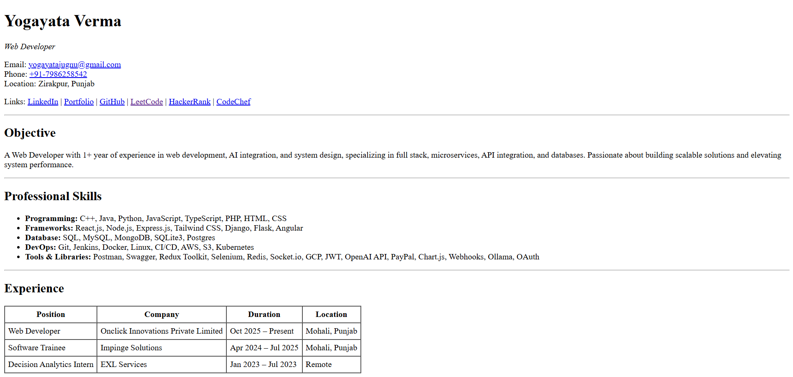
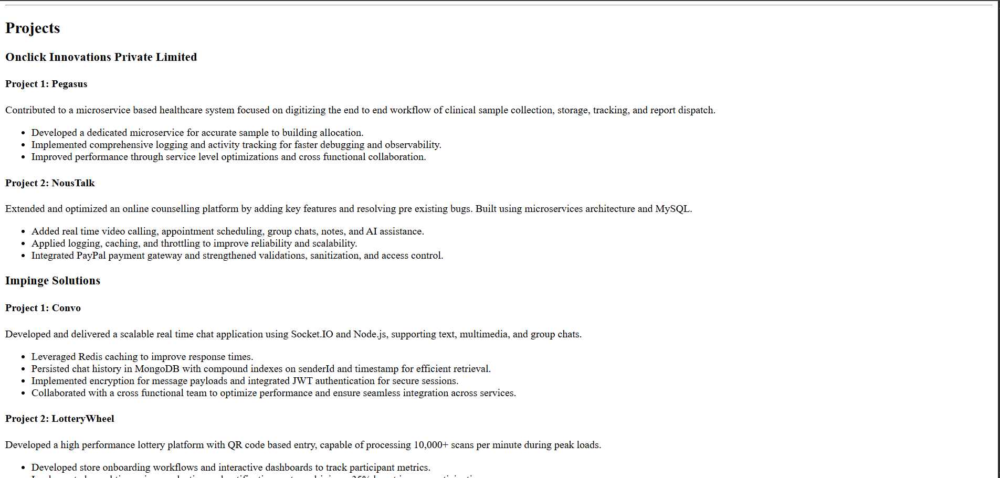
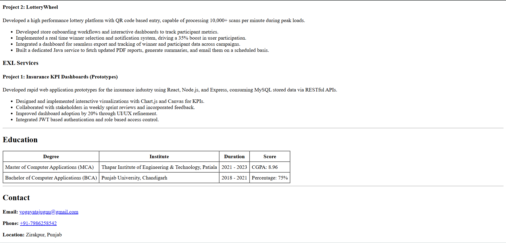
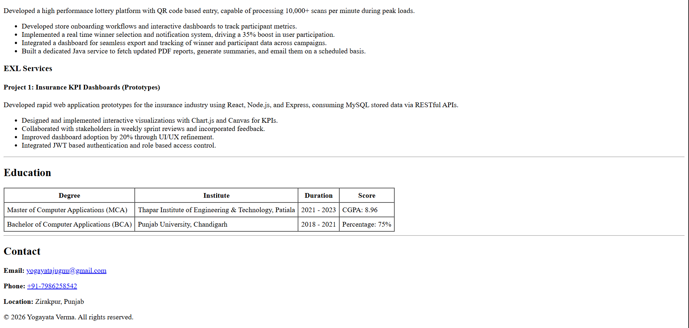

# Resume Website (HTML)

Single page resume built using only HTML, matching the provided layout.

## How to Run Locally
1. clone this repo `https://github.com/yogayataverma/HTML-Based-Resume-Page.git`
2. Open `index.html` in any browser

## Live Demo
[(Deployed Link)](https://html-based-resume-template.netlify.app/)

## Screenshots

- 
- 
- 
- 
